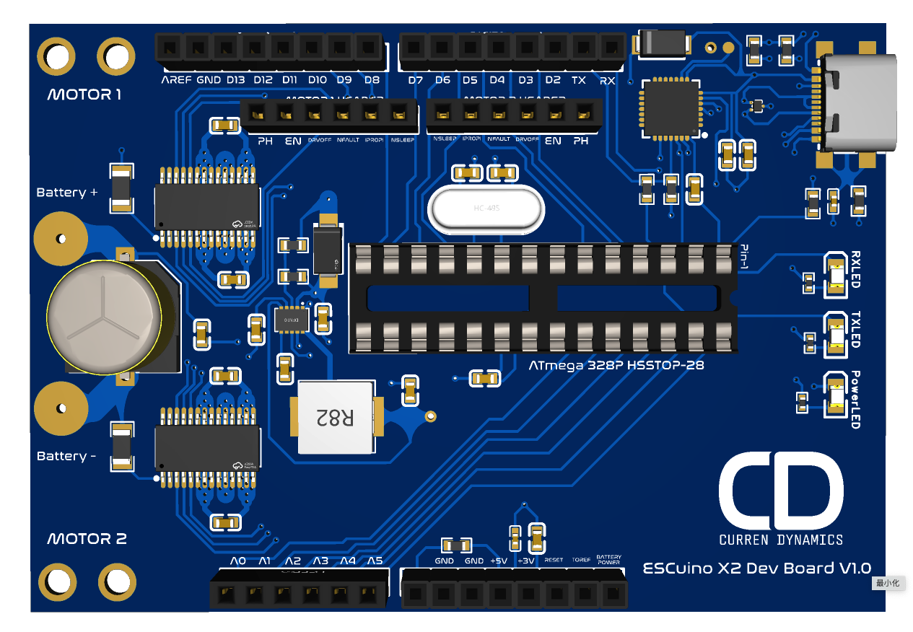

## ESCuino X2 Developer Board V1.0

The ESCuino is an open-source project by Curren Dynamics, created to empower the maker and R/C hobbyist communities with a flexible, Arduino-compatible dual brushed motor ESC (Electronic Speed Controller). Designed with versatility and customization in mind, ESCuino combines the power of a fully user-programmable microcontroller with robust, high-performance motor drivers—all in one compact board.

What is ESCuino?
At its core, ESCuino is more than just an ESC—it's a development platform. Based on the popular ATmega328P microcontroller and compatible with the Arduino IDE, it allows makers to write custom firmware, integrate sensors, automate control logic, or simply run their R/C vehicles with precise and reliable power delivery.

Whether you're prototyping a robotics project, customizing your next R/C boat, or building educational tools, ESCuino gives you the hardware foundation and software freedom to go further.

##Key Features
- **Open Source:** Schematics, firmware, and documentation are freely available.
- **Dual Brushed Motor Outputs:** Control two independent motors from one board.
- **Arduino IDE Compatible:** Code and upload firmware with tools you already know.
- **USB-C Programming & Power:** Easy connectivity and modern power support.
- **Telemetry and Sensor Integration:** Expand with your own I/O, sensors, and logic.
- **Upgradeable Firmware:** Add your own features or update over time.

##Who is it for?
- Makers and electronics hobbyists
- R/C vehicle enthusiasts (boats, cars, tanks, etc.)
- Educators and students learning embedded systems
- Anyone who wants full control over how their ESC behaves

##Get Started
- [Hardware Documentation](x2_hardware.md)
- [Development Notes](x2_development.md)
- [Community Feedback](x2_feedback.md)

###Contribute

Have feedback or want to get involved? Join the community or contribute on GitHub.

Designed in the Ozarks, USA. Built for the Frontier. 